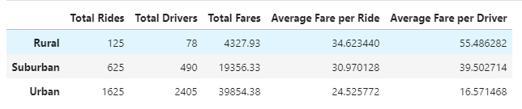
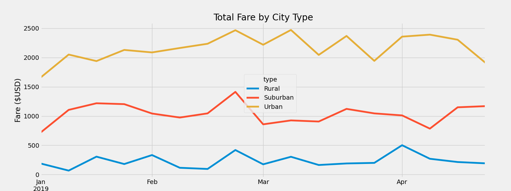

# PyBer_Analysis

# Overview
The objectives were to analyze rideshare data from January to early May of 2019 and create:

(1) A summary DataFrame for the provided data
(2) A visualization that shows the total weekly fares by city type (Urban, Suburban, and Rural)

# Results
A summary DataFrame was created and the results can be seen below:

Urban areas have the most amount of rides and drivers. There were about 2.6 times the amount of rides in urban areas than in suburban areas and 13 times the amount of rides in urban areas than in rural areas. There were almost 5 times the amount of drivers in urban areas than in suburban areas and almost 31 times the amount of drivers in urban areas than in rural areas. The average fare per ride and the average fare per driver was the lowest in urban areas ($24.52 and $16.57, respectively) and the highest in rural areas ($34.62 and $55.48, respectively). 

A multi-line chart showing total weekly fares by city type was created and the results can be seen below:

The multi-line chart visually shows the fare trend that can be seen in the summary DataFrame. From the DateFrame summary table, the total fares were the highest for urban areas, less for suburban areas, and then the lowest for rural areas. The chart clearly illustrates that this trend stays true on a weekly basis for the entire timeframe of this data. It can also be seen from the trend that that there is more variation in total fares/week from week to week for both urban and suburban areas than in urban areas. 

# Summary

Based on the analysis, some recommendations that can be made are: 

(1) It would be advisable to see how many miles each ride is for every ride in each city type. Are the drivers in rural areas driving much farther distances? What is the cost per mile? Also, how long are drivers working in each of the areas? If drivers are driving longer distances in rural areas, they could be working the same hours as those in urban areas, however, they physically won't be able to increase the number of rides in their shift due to the length of the drives they are doing. 

(2) Keeping the number of drivers the same, the fare per ride needs to be increased for rural and suburban rides if it is desired to increase the total weekly fare to be closer to those in urban areas. 

(3) It should be looked further into to see if users find the cost of rides in suburban and rural areas to be cost prohibitive enough that they use other, cheaper and/or convenient forms of transportation.  If this is the case, there should be an ad campaign to attract more drivers in urban and rural areas to help try and bring down the fare per ride or promote ride sharing as a viable option for transportation. 